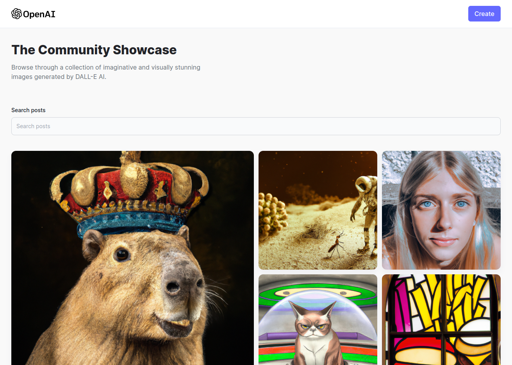

## About

This project was my first time interacting with AIs!

With the boom of <a href="https://openai.com/about/">OpenAI</a>'s <a href="https://openai.com/blog/chatgpt/">ChatGPT</a> and <a href="https://openai.com/dall-e-2/">DALL • E 2</a> I got really curious about this technology so new and yet so great at the same time, so I ended up trying to make a really simple clone of <a href="https://midjourney.com/showcase/recent//">Midjourney</a>!

OpenAI's <a href="https://platform.openai.com/docs/guides/images/introduction">image generation API</a> were used on this project.

 
---

## How It Works

Right off the bat, the Home page is shown when entering the web app. In there, the Community Showcase is available - showing all the images in the database. On hover, the prompts used to generate that image, name of the person that made the prompt and a button that allows the user to download the image are shown.

  

To be able to interact with the API, you need to click on the button at the top right side of the screen 'Create'. By blicking on the button, the user is redirected to the Create Post page.

  

In this page, the user can fill in the form fields with their name and the prompt that they want to be make a image of or simply click on the 'Surprise Me' button to get a random prompt. Following that, by clicking on Generate, the API will return an AI generated image.

The user can decide if they want to share that image with the community or not or simply make the prompt again to get a better image.

 
---

## Tech Stack

The following tools were used in the construction of this application:

-   **[React](https://pt-br.reactjs.org/docs/getting-started.html)**
-   **[React Router](https://reactrouter.com/en/main/start/tutorial#setup)**
-   **[TailwindCSS](https://tailwindcss.com/docs/installation)**
-   **[File Saver](https://www.npmjs.com/package/file-saver)**

 
**Workspace**

-   Editor:  **[Visual Studio Code](https://code.visualstudio.com/)**
-   Browser: **[Microsoft Edge](https://www.microsoft.com/en-us/edge)** (Edge on Ubuntu!? Yeah, I know...)

---

